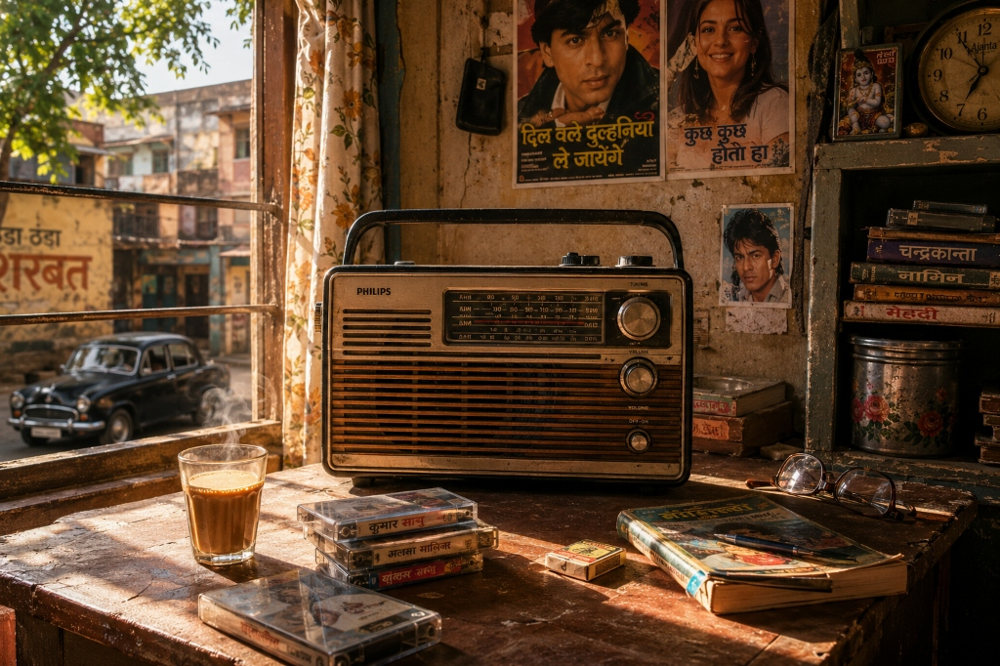

# 📻 PHIR SE (फिर से) — A Retro Audio-Visual Memory Experience

> *"Don't choose a song. Choose a memory."*



**PHIR SE** is an ultra-aesthetic, full-bleed audio-visual web application designed to trigger deep 90s & 2000s Indian nostalgia. Powered by **445+ hand-curated retro tracks**, authentic Devanagari calligraphy typography (`Amita`, `Eczar`, `Yatra One`), custom illustrated memory background scenes, and an embedded glassmorphic audio player.

---

## ✨ Key Features

- 📻 **445+ Master Retro Track Database**: Curated collection of 90s/2000s Bollywood classics, Carvaan Retro, cassette pop, and romantic melodies.
- 🎨 **10 Custom Illustrated Memories**:
  - **पुराना रेडियो (Old Radio)**
  - **बस की खिड़की (The Bus Window)**
  - **ट्रेन का सफर (The Train Ride)**
  - **बारिश की शाम (Rainy Evening)**
  - **पहला प्यार (First Love)**
  - **९०s दर्द (90s Dard)**
  - **हाईवे रात (Highway Raat)**
  - **शादी और संडे (Shaadi & Sunday)**
  - **दिलकश सैलून (Dilkash Saloon)**
  - **बचपन की छुट्टियां (Childhood Summer)**
- ✒️ **Devanagari Brush Calligraphy**: Integrated Google Fonts (`Amita`, `Eczar`, `Yatra One`) for authentic retro Indian typography.
- 🟢 **Live Visitor Counter**: Real-time visitor activity indicator with dynamic session heartbeats.
- 🎵 **Glassmorphic Tape Player**: Floating cassette vinyl player with YouTube Audio engine fallback, volume controls, seek bar, shuffle, repeat, and like functionality.
- 🌐 **Glass Social Dock**: Fixed bottom-right dock linking GitHub, LinkedIn, Instagram, and Email.

---

## 🖼️ Memory Categories

| # | Memory Scene | Hindi Title | Era & Vibe |
|---|--------------|-------------|------------|
| 01 | **Dilkash Saloon** | **दिलकश सैलून** | 90s Barber Shop, fan hum, vintage radio |
| 02 | **The Bus Window** | **बस की खिड़की** | State transport bus, sunset, green fields |
| 03 | **The Train Ride** | **ट्रेन का सफर** | Night train compartment, chai, paper cups |
| 04 | **Rainy Evening** | **बारिश की शाम** | Tea stall reflections, monsoon rain, ambient lights |
| 05 | **First Love** | **पहला प्यार** | 90s College campus romance, rose, bicycles |
| 06 | **90s Dard** | **९०s दर्द** | Lonely rainy bus stop, heartbreaking classics |
| 07 | **Highway Raat** | **हाईवे रात** | Night highway NH-48, roadside tea stall, motorcycle |
| 08 | **Shaadi & Sunday** | **शादी और संडे** | Wedding sangeet, boombox, samosas, marigold |
| 09 | **Old Radio** | **पुराना रेडियो** | Philips transistor radio, hot cutting chai, cassette tapes |
| 10 | **Childhood Summer** | **बचपन की छुट्टियां** | Marbles, Raj Comics, Gold Spot, summer break |

---

## 🛠️ Tech Stack

- **Frontend**: React 18, TypeScript, Vite
- **Styling**: Vanilla CSS with Glassmorphism, CSS Custom Properties
- **Audio Engine**: Embedded YouTube iFrame API with custom audio controls
- **Icons**: Lucide React
- **Deployment**: Vercel ready

---

## 🏃 Getting Started Locally

### Prerequisites
- Node.js (v18+)
- pnpm / npm / yarn

### Installation

1. Clone the repository:
   ```bash
   git clone https://github.com/amitkumarmadina/PHIR-SE.git
   cd PHIR-SE
   ```

2. Install dependencies:
   ```bash
   pnpm install
   ```

3. Start dev server:
   ```bash
   pnpm dev
   ```

4. Open `http://localhost:5000` in your browser.

---

## 🌐 Deploy on Vercel

1. Push code to GitHub repository (`https://github.com/amitkumarmadina/PHIR-SE`).
2. Import project into Vercel Dashboard.
3. Set **Root Directory** to `artifacts/phir-se`.
4. Build command: `pnpm build`
5. Output directory: `dist/public`

---

## 👤 Author

**Amit Kumar Madina**
- 🐙 **GitHub**: [@amitkumarmadina](https://github.com/amitkumarmadina)
- 💼 **LinkedIn**: [Amit Kumar Madina](https://www.linkedin.com/in/amitkumarmadina)
- 📸 **Instagram**: [@amitkumarmadina](https://www.instagram.com/amitkumarmadina)
- ✉️ **Email**: [amitkumarmadina9@gmail.com](mailto:amitkumarmadina9@gmail.com)

---

⭐ *If PHIR SE brought back memories, feel free to give this repository a star!*
